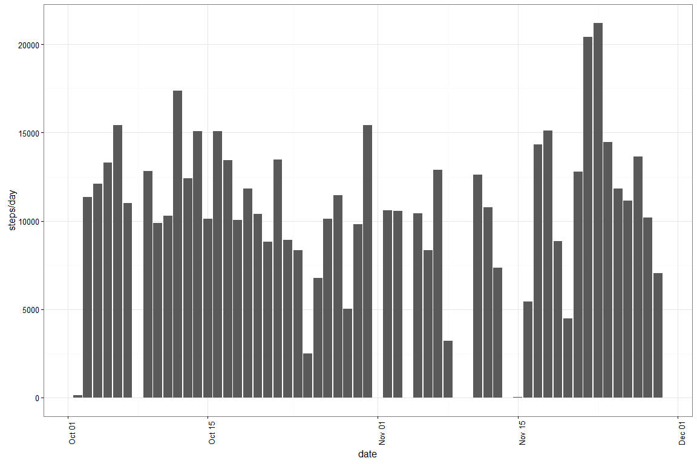
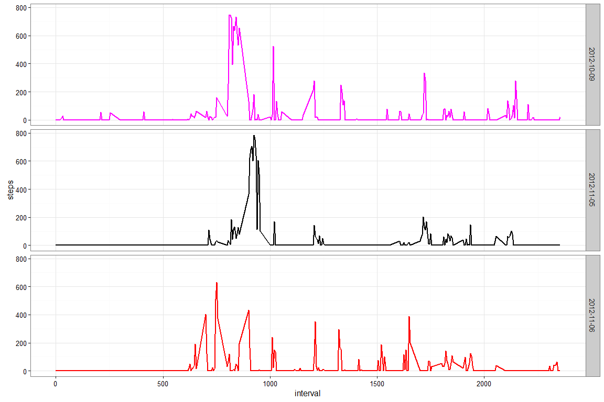
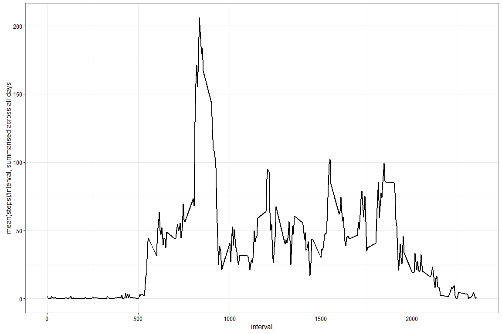
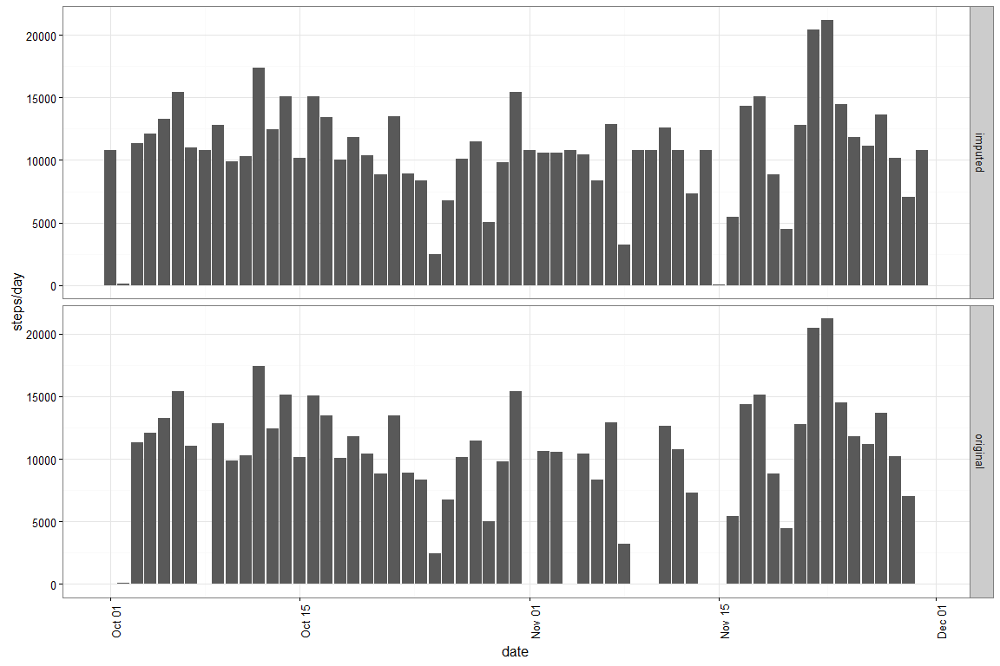
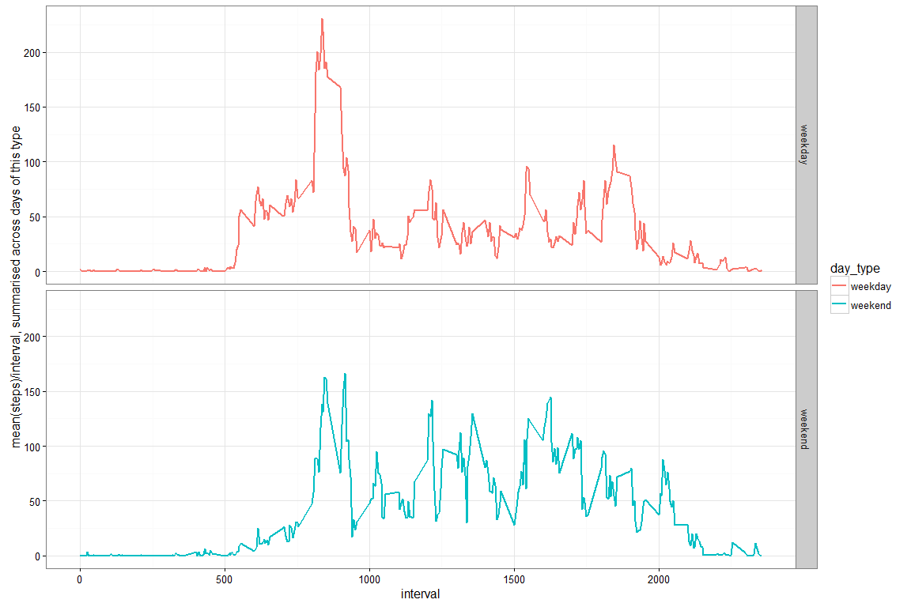

# Coursera - Reproducible Research
Ron Ammar  


```r
  # Clear the current session, to avoid errors from persisting data structures
  rm(list=ls())

  # Free up memory by forcing garbage collection
  invisible(gc())

  # Pretty printing in knitr
  library(printr)

  # Manually set the seed to an arbitrary number for consistency in reports
  set.seed(1234)

  # Do not convert character vectors to factors unless explicitly indicated
  options(stringsAsFactors=FALSE)

  startTime <- Sys.time()
```

## Background

It is now possible to collect a large amount of data about personal movement using activity monitoring devices such as a Fitbit, Nike Fuelband, or Jawbone Up. These type of devices are part of the "quantified self" movement - a group of enthusiasts who take measurements about themselves regularly to improve their health, to find patterns in their behavior, or because they are tech geeks. But these data remain under-utilized both because the raw data are hard to obtain and there is a lack of statistical methods and software for processing and interpreting the data.

This assignment makes use of data from a personal activity monitoring device. This device collects data at 5 minute intervals through out the day. The data consists of two months of data from an anonymous individual collected during the months of October and November, 2012 and include the number of steps taken in 5 minute intervals each day.

## Purpose

The purpose of this analysis is to:

1. Complete the Reproducible Research course project #1.
2. Figure out how active this anonymous dude is.

## Analysis

**Analysis Date:** 16:54:44, Sunday, February 07, 2016 


```r
  library(dplyr)
  library(ggplot2)
  
  activity <- read.csv("activity.csv")
  activity$date <- as.Date(activity$date)  # coerce to Date
  
  activityWithMissing <- activity
  # Remove dates with missing step data
  activity <- filter(activity, !is.na(steps))
```

### What is mean total number of steps taken per day?


```r
  ggplot(activity, aes(x=date, y=steps)) +
    geom_bar(stat="identity") + 
    theme_bw() + 
    theme(axis.text.x=element_text(angle=90)) +
    labs(y="steps/day")
```



```r
  averages <- activity %>%
    group_by(date) %>%
    summarise(mean_steps=mean(steps),
              median_steps=median(steps))
  averages
```


date          mean_steps   median_steps
-----------  -----------  -------------
2012-10-02     0.4375000              0
2012-10-03    39.4166667              0
2012-10-04    42.0694444              0
2012-10-05    46.1597222              0
2012-10-06    53.5416667              0
2012-10-07    38.2465278              0
2012-10-09    44.4826389              0
2012-10-10    34.3750000              0
2012-10-11    35.7777778              0
2012-10-12    60.3541667              0
2012-10-13    43.1458333              0
2012-10-14    52.4236111              0
2012-10-15    35.2048611              0
2012-10-16    52.3750000              0
2012-10-17    46.7083333              0
2012-10-18    34.9166667              0
2012-10-19    41.0729167              0
2012-10-20    36.0937500              0
2012-10-21    30.6284722              0
2012-10-22    46.7361111              0
2012-10-23    30.9652778              0
2012-10-24    29.0104167              0
2012-10-25     8.6527778              0
2012-10-26    23.5347222              0
2012-10-27    35.1354167              0
2012-10-28    39.7847222              0
2012-10-29    17.4236111              0
2012-10-30    34.0937500              0
2012-10-31    53.5208333              0
2012-11-02    36.8055556              0
2012-11-03    36.7048611              0
2012-11-05    36.2465278              0
2012-11-06    28.9375000              0
2012-11-07    44.7326389              0
2012-11-08    11.1770833              0
2012-11-11    43.7777778              0
2012-11-12    37.3784722              0
2012-11-13    25.4722222              0
2012-11-15     0.1423611              0
2012-11-16    18.8923611              0
2012-11-17    49.7881944              0
2012-11-18    52.4652778              0
2012-11-19    30.6979167              0
2012-11-20    15.5277778              0
2012-11-21    44.3993056              0
2012-11-22    70.9270833              0
2012-11-23    73.5902778              0
2012-11-24    50.2708333              0
2012-11-25    41.0902778              0
2012-11-26    38.7569444              0
2012-11-27    47.3819444              0
2012-11-28    35.3576389              0
2012-11-29    24.4687500              0

It would appear that for most of the day, according to each of the measured intervals, this individual is not taking any steps, which is why the median steps is 0 for each day.

For example, if we just look at a few individual days:


```r
  threeDays <- activity %>%
    filter(date %in% sample(averages$date, 3)) %>%
    arrange(date)
  
  ggplot(threeDays, aes(x=interval, y=steps, col=date)) +
    facet_grid(date ~ .) +
    geom_line(size=1) +
    theme_bw()
```



This is explained further in the next section.

### What is the average daily activity pattern?


```r
  averagePattern <- activity %>%
    group_by(interval) %>%
    summarise(mean_steps=mean(steps))
  
  ggplot(averagePattern, aes(x=interval, y=mean_steps)) +
    geom_line(size=1) +
    theme_bw() +
    labs(y="mean(steps)/interval, summarised across all days")
```



This individual does most of their activity at 5 minute interval #835.

### Imputing missing values

There are 2304 missing values in the dataset.

We're going to impute the values that are missing using the suggested method of filling missing values with the mean across all days. However, before proceeding with this method, I need to ensure that there is no interval that is missing for *all* dates. If there is, we'd have to switch to a daily mean strategy.


```r
  # If any NaN values remain after averaging, that means a single interval
  # contained all NAs.
  averageWithMissingPattern <- activityWithMissing %>%
    group_by(interval) %>%
    summarise(mean_steps=mean(steps, na.rm=TRUE))
  
  allNA <- any(is.nan(averageWithMissingPattern$mean_steps))
```

Since `allNA` equals `FALSE`, we can use this mean activity strategy for imputation.


```r
  imputedActivity <- activityWithMissing %>%
    filter(is.na(steps)) %>%
    left_join(averageWithMissingPattern, by="interval") %>%
    select(-steps) %>%
    dplyr::rename(steps=mean_steps)
  
  # Add activity data and rearrange
  imputedActivity <- activity %>%
    bind_rows(imputedActivity) %>%
    arrange(date, interval) %>%
    mutate(type="imputed")
```

Now, let's see how the imputed activity differs from the original activity


```r
  comparisonActivity <- activity %>%
    arrange(date, interval) %>%  # ensure same order
    mutate(type="original") %>%
    bind_rows(imputedActivity)
  
  ggplot(comparisonActivity, aes(x=date, y=steps)) +
    facet_grid(type ~ .) +
    geom_bar(stat="identity") + 
    theme_bw() + 
    theme(axis.text.x=element_text(angle=90)) +
    labs(y="steps/day")
```



```r
  averagesOriginal <- comparisonActivity %>%
    filter(type == "original") %>%
    group_by(date) %>%
    summarise(mean_steps=mean(steps),
              median_steps=median(steps))
  
  averagesImputed <- comparisonActivity %>%
    filter(type == "imputed") %>%
    group_by(date) %>%
    summarise(imputed_mean_steps=mean(steps),
              imputed_median_steps=median(steps))
  
  averages <- left_join(averagesImputed, averagesOriginal, by="date")
  averages
```


date          imputed_mean_steps   imputed_median_steps   mean_steps   median_steps
-----------  -------------------  ---------------------  -----------  -------------
2012-10-01            37.3825996               34.11321           NA             NA
2012-10-02             0.4375000                0.00000    0.4375000              0
2012-10-03            39.4166667                0.00000   39.4166667              0
2012-10-04            42.0694444                0.00000   42.0694444              0
2012-10-05            46.1597222                0.00000   46.1597222              0
2012-10-06            53.5416667                0.00000   53.5416667              0
2012-10-07            38.2465278                0.00000   38.2465278              0
2012-10-08            37.3825996               34.11321           NA             NA
2012-10-09            44.4826389                0.00000   44.4826389              0
2012-10-10            34.3750000                0.00000   34.3750000              0
2012-10-11            35.7777778                0.00000   35.7777778              0
2012-10-12            60.3541667                0.00000   60.3541667              0
2012-10-13            43.1458333                0.00000   43.1458333              0
2012-10-14            52.4236111                0.00000   52.4236111              0
2012-10-15            35.2048611                0.00000   35.2048611              0
2012-10-16            52.3750000                0.00000   52.3750000              0
2012-10-17            46.7083333                0.00000   46.7083333              0
2012-10-18            34.9166667                0.00000   34.9166667              0
2012-10-19            41.0729167                0.00000   41.0729167              0
2012-10-20            36.0937500                0.00000   36.0937500              0
2012-10-21            30.6284722                0.00000   30.6284722              0
2012-10-22            46.7361111                0.00000   46.7361111              0
2012-10-23            30.9652778                0.00000   30.9652778              0
2012-10-24            29.0104167                0.00000   29.0104167              0
2012-10-25             8.6527778                0.00000    8.6527778              0
2012-10-26            23.5347222                0.00000   23.5347222              0
2012-10-27            35.1354167                0.00000   35.1354167              0
2012-10-28            39.7847222                0.00000   39.7847222              0
2012-10-29            17.4236111                0.00000   17.4236111              0
2012-10-30            34.0937500                0.00000   34.0937500              0
2012-10-31            53.5208333                0.00000   53.5208333              0
2012-11-01            37.3825996               34.11321           NA             NA
2012-11-02            36.8055556                0.00000   36.8055556              0
2012-11-03            36.7048611                0.00000   36.7048611              0
2012-11-04            37.3825996               34.11321           NA             NA
2012-11-05            36.2465278                0.00000   36.2465278              0
2012-11-06            28.9375000                0.00000   28.9375000              0
2012-11-07            44.7326389                0.00000   44.7326389              0
2012-11-08            11.1770833                0.00000   11.1770833              0
2012-11-09            37.3825996               34.11321           NA             NA
2012-11-10            37.3825996               34.11321           NA             NA
2012-11-11            43.7777778                0.00000   43.7777778              0
2012-11-12            37.3784722                0.00000   37.3784722              0
2012-11-13            25.4722222                0.00000   25.4722222              0
2012-11-14            37.3825996               34.11321           NA             NA
2012-11-15             0.1423611                0.00000    0.1423611              0
2012-11-16            18.8923611                0.00000   18.8923611              0
2012-11-17            49.7881944                0.00000   49.7881944              0
2012-11-18            52.4652778                0.00000   52.4652778              0
2012-11-19            30.6979167                0.00000   30.6979167              0
2012-11-20            15.5277778                0.00000   15.5277778              0
2012-11-21            44.3993056                0.00000   44.3993056              0
2012-11-22            70.9270833                0.00000   70.9270833              0
2012-11-23            73.5902778                0.00000   73.5902778              0
2012-11-24            50.2708333                0.00000   50.2708333              0
2012-11-25            41.0902778                0.00000   41.0902778              0
2012-11-26            38.7569444                0.00000   38.7569444              0
2012-11-27            47.3819444                0.00000   47.3819444              0
2012-11-28            35.3576389                0.00000   35.3576389              0
2012-11-29            24.4687500                0.00000   24.4687500              0
2012-11-30            37.3825996               34.11321           NA             NA

By imputing the activity data, it looks like we can generate rough estimates for activity on days with no activity at all. These numbers appear to be in line with the general activity profile, as plotted in the histograms.

### Are there differences in activity patterns between weekdays and weekends?


```r
  # Get the weekdays from the dates and then classify them as weekends or
  # weekdays
  convertDay <- function(date) {
    day_type <- ifelse(weekdays(date) %in% c("Saturday", "Sunday"),
                       "weekend",
                       "weekday")
    return(day_type)
  }
  
  imputedActivity <- mutate(imputedActivity, day_type=convertDay(date))
  
  # Plot activity faceted by day type
  averageImputedPattern <- imputedActivity %>%
    group_by(interval, day_type) %>%
    summarise(mean_steps=mean(steps))
  
  ggplot(averageImputedPattern,
         aes(x=interval, y=mean_steps, col=day_type)) +
    facet_grid(day_type ~ .) +
    geom_line(size=1) +
    theme_bw() +
    labs(y="mean(steps)/interval, summarised across days of this type")
```



On average, looks like this dude has similar activity on weekdays and weekends, except that he/she starts that activity a little later on the weekend. Probably because he/she gets up early on weekdays to go to work as a code monkey.


------

## System Information

***Time required to process this report:*** *4.014824 secs*

***R session information:***


```r
  sessionInfo()
```

```
## R version 3.2.3 (2015-12-10)
## Platform: i386-w64-mingw32/i386 (32-bit)
## Running under: Windows 7 (build 7601) Service Pack 1
## 
## locale:
## [1] LC_COLLATE=English_United States.1252 
## [2] LC_CTYPE=English_United States.1252   
## [3] LC_MONETARY=English_United States.1252
## [4] LC_NUMERIC=C                          
## [5] LC_TIME=English_United States.1252    
## 
## attached base packages:
## [1] stats     graphics  grDevices utils     datasets  methods   base     
## 
## other attached packages:
## [1] ggplot2_2.0.0   dplyr_0.4.3     printr_0.0.5    rmarkdown_0.9.2
## [5] knitr_1.12.3   
## 
## loaded via a namespace (and not attached):
##  [1] Rcpp_0.12.3      magrittr_1.5     munsell_0.4.2    colorspace_1.2-6
##  [5] R6_2.1.2         stringr_1.0.0    highr_0.5.1      plyr_1.8.3      
##  [9] tools_3.2.3      parallel_3.2.3   grid_3.2.3       gtable_0.1.2    
## [13] DBI_0.3.1        htmltools_0.3    yaml_2.1.13      lazyeval_0.1.10 
## [17] assertthat_0.1   digest_0.6.9     reshape2_1.4.1   formatR_1.2.1   
## [21] evaluate_0.8     labeling_0.3     stringi_1.0-1    scales_0.3.0
```
